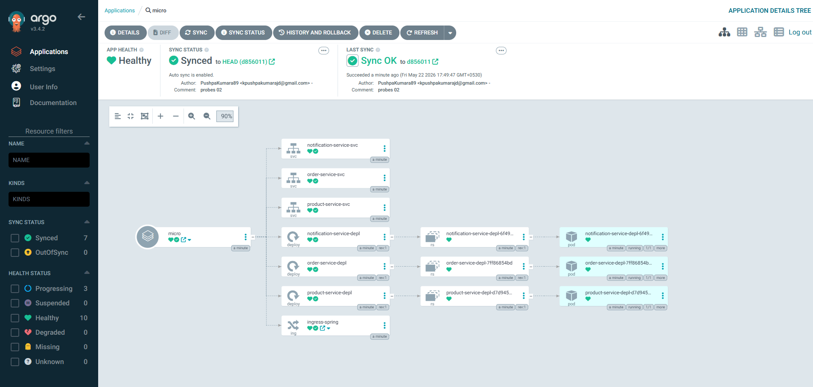
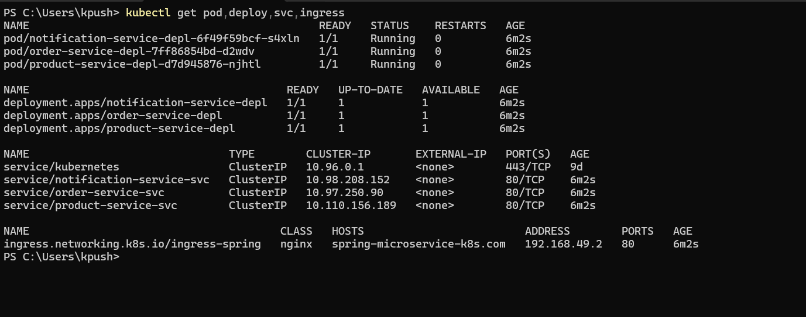

# Enterprise Microservices Platform with Kubernetes & GitOps

An end-to-end distributed microservices architecture built using **Spring Boot**, **Angular**, and **Docker**, fully orchestrated with **Kubernetes (Minikube)** and deployed using GitOps principles via **ArgoCD**.

---

## 🏗️ System Architecture

This project consists of independent microservices communicating with each other synchronously/asynchronously and managed under a unified local Kubernetes cluster.

* **Product Service:** Manages product catalogs (`Port: 8081`).
* **Order Service:** Handles customer order placements (`Port: 8082`).
* **Notification Service:** Dispatches notifications based on order events (`Port: 8083`).
* **Frontend Web App:** Angular standalone components-based user interface.

---

## 🛠️ Tech Stack & DevOps Toolkit

* **Backend:** Java 21 / Spring Boot 3.x (Spring Web, Spring Data JPA, Actuator)
* **Frontend:** Angular (Standalone Components)
* **Containerization:** Docker / Docker Hub
* **Orchestration:** Kubernetes (Pods, Deployments, Services)
* **GitOps & CI/CD:** ArgoCD & GitHub Actions
* **Local Cluster:** Minikube / Kind

---

## 🚀 DevOps & Kubernetes Implementations

### 1. Production-Ready Resource Management
To prevent noisy-neighbor problems and ensure cluster stability, strict resource boundaries are configured for each microservice deployment:
* **Requests:** `cpu: "200m"`, `memory: "512Mi"` (Guaranteed startup resources)
* **Limits:** `cpu: "500m"`, `memory: "768Mi"` (Throttling safety nets & OOM protection)

### 2. High-Availability Health Checks (Probes)
Configured advanced self-healing capabilities using three-tier Kubernetes Probes to avoid premature rolling-update failures in Spring Boot applications:
* **Startup Probe:** Uses an extended `failureThreshold: 25` with `periodSeconds: 3` giving the Spring Boot context a comfortable **75 seconds** to boot up before any liveness checks fail.
* **Liveness Probe:** Monitors application locks or freezes (`/actuator/health/liveness`).
* **Readiness Probe:** Ensures no traffic is routed until the application is fully ready (`/actuator/health/readiness`).

---

## 🔧 How to Run Locally

### Prerequisites
* Minikube installed
* kubectl CLI
* Java 21 & Node.js (Optional for local development)

### 1. Start the Kubernetes Cluster
```bash
minikube start --cpus 4 --memory 8192
```

### 2. Apply Manifests Manually (Or via ArgoCD)
```bash
kubectl apply -f K8s/product-depl.yaml
kubectl apply -f K8s/order-depl.yaml
kubectl apply -f K8s/notification-depl.yaml
```
### 3. Verify System Health
```bash
kubectl get pods -w
```


